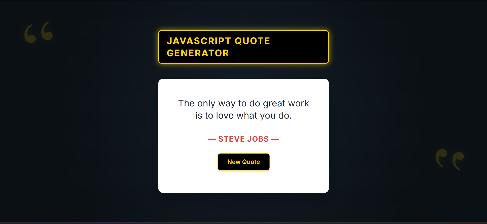

# Quote-generator-app
🌟 Inspirational Quote Generator
<!--user interface webpage-->

This is a simple, modern, and stylish web application designed to generate random inspirational quotes with a single click. The design features a dark, gold-accented theme, providing a visually appealing and focused user experience.

The project is built entirely using vanilla JavaScript, HTML, and Tailwind CSS (via CDN) for a lightweight and highly performant front-end experience.

#LIVEDEMO Your site is live at https://bati58.github.io/Quote-generator-app/

✨ Features

Stylish Design: A visually striking interface with a gold-and-black theme, featuring large decorative quote marks and responsive layout.

Instant Quote Generation: Click the "New Quote" button to instantly display a new, randomly selected inspirational quote.

Quote Diversity: The generator includes a curated list of 20 classic and contemporary motivational quotes.

Pure Front-End: No back-end dependencies required; the application runs entirely in the browser.

💻 Technologies Used

HTML5: For the core structure of the application.

CSS3 (Tailwind CSS): Used for rapid and responsive utility-first styling.

JavaScript (ES6+): For the quote logic, random selection, and DOM manipulation.

🚀 Getting Started

To run this project locally, simply clone the repository and open the index.html file in your web browser.

Prerequisites

You only need a modern web browser (Chrome, Firefox, Edge, etc.).

Installation

Clone the Repository:

git clone [https://github.com/bati58/Quote-generator-app.git](https://github.com/bati58/Quote-generator-app.git)
cd Quote-generator-app

Open the File:
Locate the index.html file in the project folder and double-click it, or right-click and choose "Open with Live Server" (if using a VS Code extension) or "Open with [Your Browser]".

📂 Project Structure

The project is structured into three main files for clean separation of concerns:

File

Purpose

index.html

Defines the page structure, loads Tailwind CSS, and links the external CSS and JavaScript.

style.css

Contains custom CSS for the dark background, gold accents, decorative quote marks, and button effects.

script.js

Contains the array of quotes and the logic to select a random quote and update the HTML content with a fade effect.

💡 Future Enhancements

Integration with a public Quote API (e.g., Quotable, ZenQuotes) for unlimited quote variety.

Adding a "Copy to Clipboard" button.

Implementing a social media share button (e.g., Twitter/X).

Allowing users to submit their own quotes (requires storage/back-end).

Made with ❤️ by bati
